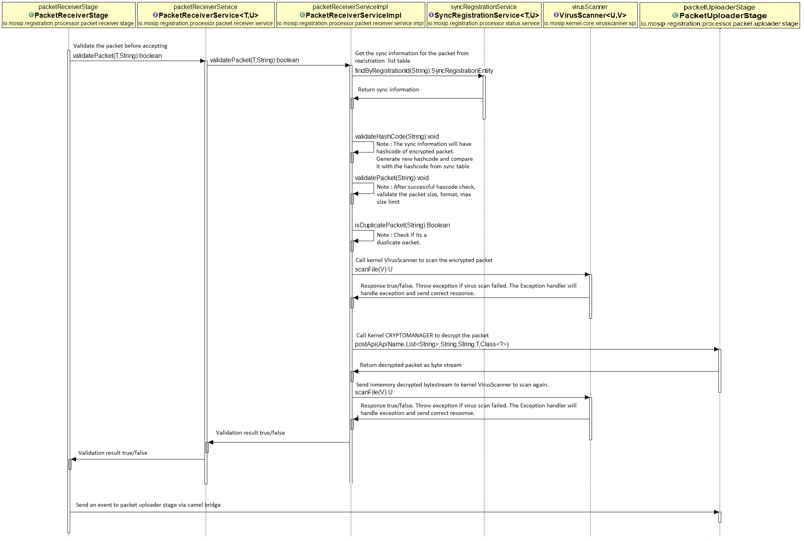

# Approach for Packet receiver Stage

**Background**

Once the packets are created in registration-client the packet information will be synced first using sync API and packets will be uploaded to registration-processor using packetreceiver API.

The target users are -
The registration client.
External system integrator.
Residence service portal to integrate with registration-processor.

The key requirements are -
1. Provide an api to upload registration packets from registration-client.
2. Validate packet before accepting in registration processor.
3. Perform virus scan of the encrypted and the decrypted packet in memory.
4. Store packet to a secure location after virus scan is successful.
5. Send event to next stage to pick the packet from secure location and start processing.


The key non-functional requirements are
1.	Auditing of the all the transactions including success and failed scenario:
2.	Logging of the all the requests
a.	INFO log message in case print request success or failed
b.	DEBUG log message in case if data fetched, PDF and text documents are created, PDF send on the queue.
c.	ERROR log message in case of any exception
3.	Exception handling


**Solution**

The key solution considerations are -
1.	A new stage "registration-processor-packet-receiver-stage" inside registration-processor/init directory. This stage will be deployed in DMZ zone.
```java
public class PacketReceiverStage extends MosipVerticleAPIManager {
// Add code here.
}
```
2.	A rest endpoint using vertx web to upload the packets in LANDING_ZONE. Click -> [API spec for packetreceiver](https://github.com/mosip/mosip/wiki/Registration-Processor-APIs#1-packet-receiver-service) to see the api specifications..
		1. server.servlet.path = v1/packetreceiver
		2. URI : /registrationpackets
3. An exception handler - "PacketReceiverExceptionHandler.java" to handle the exception and send the response to the rest api consumer.
4.	PacketReceiverService interface to validate the packet before accepting it to the landing zone. Perform below validations -
		1. Call SyncRegistrationService.findByRegistrationId() to get the sync information for the packet. Fail the validation if there is no sync record against the registration id. Throw exception and let the exception handler send response.
		2. Generate the hashcode using kernel HMACUtils. Compare the hashcode with the sync hashcode. If both are not same then throw exception and let the exception handler send response. 
		3. Validate packet size present in sync with the actual packet size. Read the packet format from config server and validate with the packet format(Config server key : registration.processor.packet.ext). Check if the sized of the packet is within the max limit defined in config server(key : registration.processor.max.file.size). In case of failure throw exception and let the exception handler send response.
		4. Check if the packet received is duplicate of already received packet. If the registration id is present in 'registration' table and externel status is not "resend" then the packet will be considered as duplicate.
4.	After successful above validation call kernel VirusScanner.scanFile() and send the encrypted packet as input stream. It will return boolean value. Throw exception as virus scan failed if the VirusScanner returns false. Let the exceptionHandler sends response to the api consumer.
5.	After successful scan of the encrypted packet call kernel cryptomanager rest api to decrypt the packet. Use RegistrationProcessorRestClientService.postApi() to consume cryptomanager API. [Click on the link](https://github.com/mosip/mosip/wiki/Kernel-APIs#2-crypto-manager) to see the request and response specs of kernel cryptomanager.
6.	The cryptomanager will return byte stream after successful decryption. Send same byte stream to kernel VirusScanner again to perform one more round of scan. Fail the validation if VirusScanner returns false and  let the exceptionHandler sends response to the api consumer.
7.	After all above validations are passed send a response to the camel bridge for further processing.
8.	Add RegProcessorLogger, AuditLogRequestBuilder whereever applicable.


**Class Diagram**

------------


**Sequence Diagram**

------------


