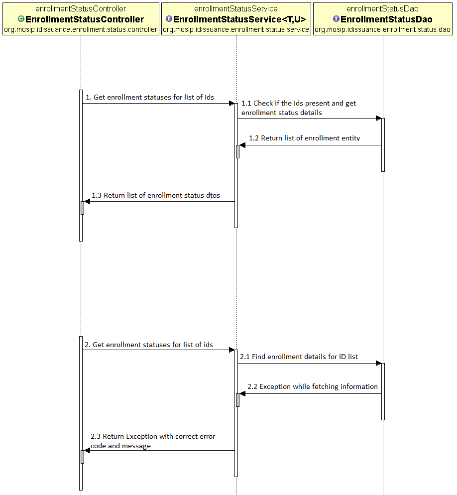

# Approach for Packet Validator

**Background**
The camel bridge will send an event to registration-processor-connector stage after packet moved to packet store. The The connector stage will send an event to packet-validator-stage for further validation.

The target users are
-	Server application, which will store sync information.
-	Administrator of the platform who may need to verify the sync info.

The key requirements are
-	Packet integrity validation by comparing checksum value.
-	Validate the list of required files are present in packet before start processing.
-	Validate required applicant documents are present inside packet.

The key non-functional requirements are
-	Performance: Should validate hundreds of packets per second.

**Solution**
The key solution considerations are
-	Create Registration and Transaction entity and create dao layer for below crud operations:
o	Required files present inside packet.
o	Integrity of the packet by comparing checksum value.
o	Validate applicant document.

##### 1.	Validation – 1: Validate Required files present inside packet
- The decrypted packet sends packet related information inside packet_meta_info.json file. This will have information on all required files inside the hash sequence. There are 2 hashSequence present inside packet -> 
1. hashSequence1 
	i. applicantBiometricSequence
	ii. introducerBiometricSequence
	iii. applicantDemographicSequence
2. hashSequence2
	i. otherFiles
	
- The above hash sequence has all the required files for processing the packet. The files should be present inside the packet as well. 
- In case of any missing file the validation will fail and registration status will be updated as "STRUCTURE_VALIDATION_FAILED" and fail the validation. Send message to camel bridge to acknowledge the applicant
- In case of successful file validation move to the next check.

##### 2.	Validation – 2: Integrity of the packet by comparing checksum value
- Read below hashsequence fields in same order present inside packet_meta_info json file-
	1. applicantBiometricSequence
	2. introducerBiometricSequence
	3. applicantDemographicSequence
	4. otherFiles
- Use kernel FileSystemAdapter to get each file with filename present inside hash sequence.
- Call kernel HMACUtils to generate hashSequence1 and hashSequence2 separately. The hashSequence1 includes "applicantBiometricSequence", "introducerBiometricSequence" and "applicantDemographicSequence". The hashSequence2 includes "otherFiles".
- The packet will have packet_data_hash and osi_data_hash. Compare packet_data_hash with hashSequence1 and osi_data_hash to hashSequence2.
- If both the hash sequence matches then proceed to the next check.
- In case of mismatch fail the validation and update registration status as "STRUCTURE_VALIDATION_FAILED" and fail the validation. Send message to camel bridge to acknowledge the applicant

##### 3.	Validation – 3: Validate requied documents
- Get mandatory required document categories and types based on applicant type from masterdata api. 
- Check if the document  is present for the document category. 
- Fail the validation if document is missing.
- Pass the validation if all documents are present. Send message to camel bridge after all successful validation.

**Class Diagram**

**Sequence Diagram**

